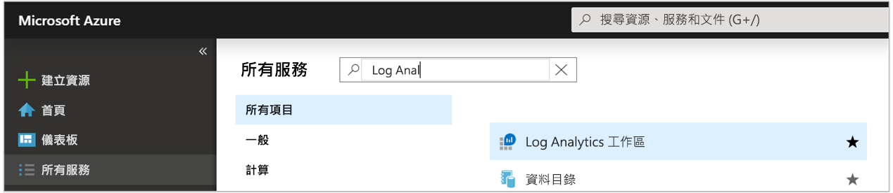
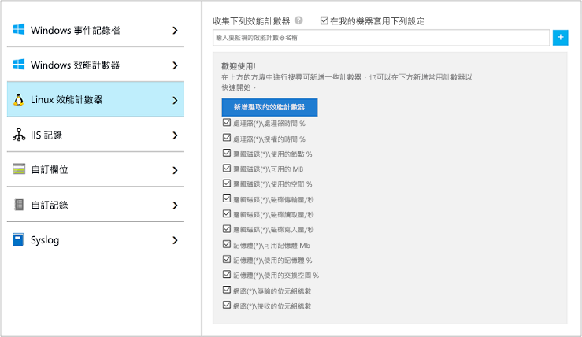
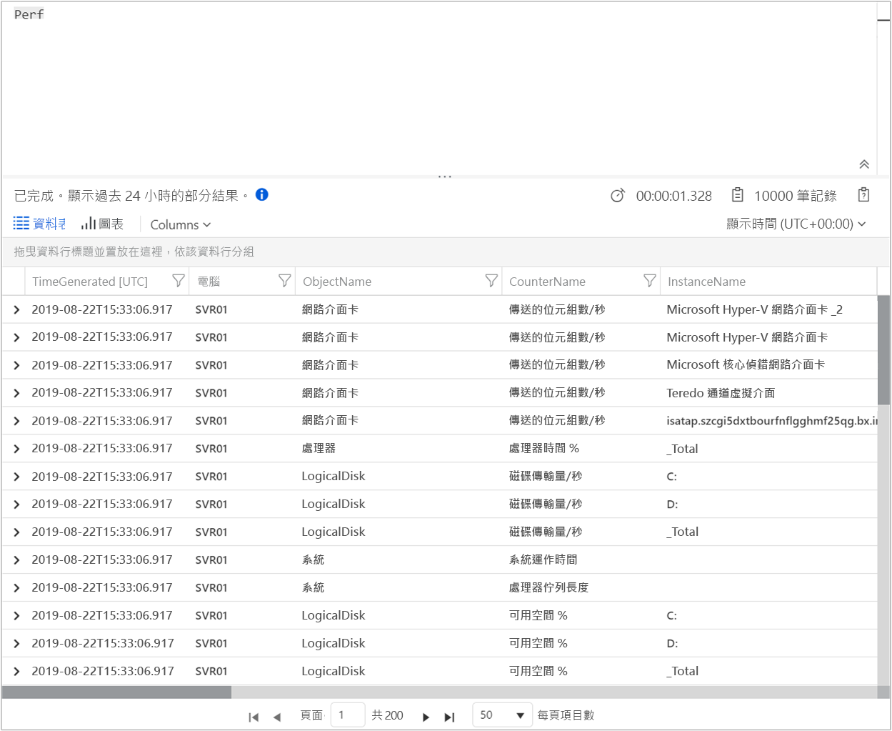
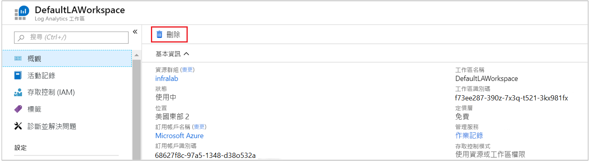

# <a name="collect-data-from-an-azure-virtual-machine-with-azure-monitor"></a>使用 Azure 監視器從 Azure 虛擬機器收集資料

[Azure 監視器](../overview.md)可將來 Azure 虛擬機器的資料直接收集到 Log Analytics 工作區，以供詳細分析和相互關聯。 安裝適用於 [Windows](../../virtual-machines/extensions/oms-windows.md) 和 [Linux](../../virtual-machines/extensions/oms-linux.md) 的 Log Analytics VM 擴充功能，可允許 Azure 監視器收集您 Azure VM 中的資料。 本快速入門向您示範如何以幾個簡單的步驟，使用 VM 擴充功能來設定和收集 Azure Linux 或 Windows VM 的資料。  
 
本快速入門假設您有現有的 Azure 虛擬機器。 如果沒有，您可以遵循 VM 快速入門來[建立 Windows VM](../../virtual-machines/windows/quick-create-portal.md) 或[建立 Linux VM](../../virtual-machines/linux/quick-create-cli.md)。

## <a name="sign-in-to-azure-portal"></a>登入 Azure 入口網站

登入 Azure 入口網站：[https://portal.azure.com](https://portal.azure.com)。 

## <a name="create-a-workspace"></a>建立工作區

1. 在 Azure 入口網站中，選取 [所有服務]  。 在資源清單中輸入 **Log Analytics**。 當您開始輸入時，清單會根據您輸入的文字進行篩選。 選取 [Log Analytics 工作區]  。

    <br>  

2. 選取 [建立]  ，然後選取下列項目的選項：

   * 為新的 [Log Analytics 工作區]  提供名稱，例如 DefaultLAWorkspace  。  
   * 或者是使用下面的 shell 指令產生有亂數的名字 
    ```bash
    workspaceName=myWorkspace-$RANDOM
    echo $workspaceName
    ```
    
   * 如果選取的預設值不合適，請從下拉式清單中選取要連結的 [訂用帳戶]  。
   * 對於 [資源群組]  ，選取包含一或多個 Azure 虛擬機器的現有資源群組。  
   * 選取要部署 VM 的 [位置]  。  如需詳細資訊，請查看 [Log Analytics 的可用區域](https://azure.microsoft.com/regions/services/)。
  
        ![[建立 Log Analytics] 資源刀鋒視窗](media/quick-collect-azurevm/create-log-analytics-workspace-azure-portal.png) 

3. 在 [Log Analytics 工作區]  窗格中提供必要資訊之後，選取 [確定]  。  

在驗證資訊及建立工作區時，您可以在功能表的 [通知]  底下追蹤其進度。 

## <a name="enable-the-log-analytics-vm-extension"></a>啟用 Log Analytics VM 延伸模組

[!INCLUDE [log-analytics-agent-note](../../../includes/log-analytics-agent-note.md)] 

對於已部署在 Azure 中的 Windows 和 Linux 虛擬機器，您可以使用 Log Analytics VM 延伸模組來安裝 Log Analytics 代理程式。 使用擴充可以簡化安裝程序，並自動設定代理程式將資料傳送到您指定的 Log Analytics 工作區。 代理程式也會在發行新版本時自動升級，以確保您擁有最新的功能和修正程式。 在繼續之前，請確認 VM 正在執行，否則此程序將無法順利完成。  

>[!NOTE]
>適用於 Linux 的 Log Analytics 代理程式無法設定為回報多個 Log Analytics 工作區。 

1. 在 Azure 入口網站中，選取左上角的 [所有服務]  。 在資源清單中輸入 **Log Analytics**。 當您開始輸入時，清單會根據您輸入的文字進行篩選。 選取 [Log Analytics 工作區]  。

2. 在 Log Analytics 工作區清單中，選取稍早建立的 *$workspaceName*。

3. 在左側功能表的 [工作區資料來源] 下方，選取 [虛擬機器]  。  

4. 在 [虛擬機器]  清單中，選取要在上面安裝代理程式的虛擬機器。 請注意，VM 的 [Log Analytics 連接狀態]  會指出它是 [未連接]  狀態。

5. 在虛擬機器的詳細資訊中，選取 [連接]  。 隨即會為 Log Analytics 工作區自動安裝和設定代理程式。 這個程序需要幾分鐘的時間，在這段期間的 [狀態]  會顯示為 [正在連線]  。

6. 安裝並連接代理程式之後，[Log Analytics 連接狀態]  會更新為 [此工作區]  。

## <a name="collect-event-and-performance-data"></a>收集事件和效能資料

Azure 監視器可以從 Windows 事件記錄或 Linux Syslog 收集事件，和收集您指定要用於較長期分析和報告的效能計數器，並在偵測到特定條件時採取動作。 請遵循下列步驟來開始設定收集 Windows 系統記錄檔和 Linux Syslog 的事件以及數個常用的效能計數器。  

### <a name="data-collection-from-linux-vm"></a>從 Linux VM 收集資料

1. 選取 [Syslog]  。  

2. 您可以輸入記錄檔的名稱，來新增事件記錄檔。  輸入 **Syslog**，然後選取加號 **+** 。  

3. 在表格中，取消選取 [資訊]  、[注意]  和 [偵錯]  嚴重性。 

4. 選取頁面頂端的 [儲存]  來儲存設定。

5. 選取 [Linux 效能資料]  以啟用 Linux 電腦上的效能計數器收集。 

6. 當您第一次為新的 Log Analytics 工作區設定 Linux 效能計數器時，系統會提供選項，讓您快速建立數個常用的計數器。 這些計數器旁邊皆會列出核取方塊。

    

    選取 [將下列設定套用至我的機器]  ，然後選取 [新增選取的效能計數器]  。  隨即會新增且收集取樣間隔時間的預設值為 10 秒。  

7. 選取頁面頂端的 [儲存]  來儲存設定。

## <a name="view-data-collected"></a>檢視收集的資料

現在您已啟用資料收集，可以執行簡單的記錄搜尋範例，查看來自目標 VM 的一些資料。  

1. 在選取的工作區中，從左側窗格中選取 [記錄]  。

2. 在記錄查詢頁面的查詢編輯器中輸入 `Perf`，然後選取 [執行]  。

     

    例如，下圖中的查詢會傳回 10,000 筆效能記錄。 結果將會大幅減少。

    

## <a name="clean-up-resources"></a>清除資源

不再需要 Log Analytics 工作區時，請予以刪除。 若要這樣做，請選取您稍早建立的 Log Analytics 工作區，然後在資源頁面上，選取 [刪除]  。



