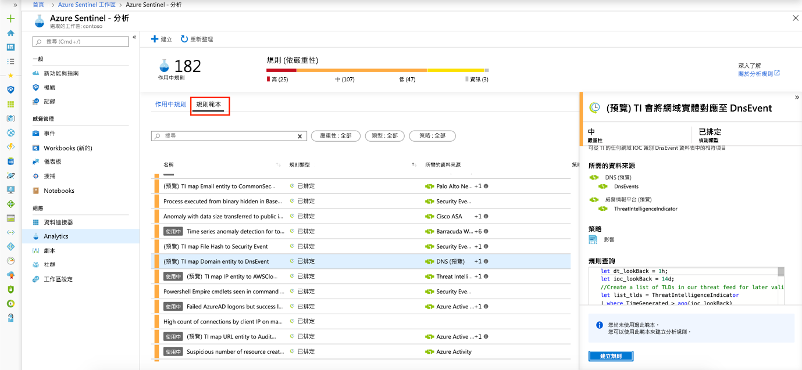

# 教學課程：預設偵測到威脅

> [!IMPORTANT]
> 預設的威脅偵測目前為公開預覽版。
> 這項功能是在沒有服務等級協定的情況下提供，不建議用於生產工作負載。
> 如需詳細資訊，請參閱 [Microsoft Azure 預覽版增補使用條款](https://azure.microsoft.com/support/legal/preview-supplemental-terms/)。

在您將 資料來源連接 到 Azure Sentinel 之後，您會想要在發生可疑的情況時收到通知。 為了讓您這麼做，Azure Sentinel 提供現成可用的內建範本。 這些範本是由 Microsoft 的安全性專家和分析師團隊所設計，以已知的威脅、常見的攻擊媒介和可疑的活動擴大鏈為基礎。 啟用這些範本之後，他們會自動搜尋在您環境中看起來可疑的任何活動。 許多範本都可以根據您的需求自訂，以搜尋或篩選出活動。 這些範本所產生的警示將會建立您可以在環境中指派和調查的事件。

本教學課程可協助您偵測 Azure Sentinel 的威脅：

> * 使用現成可用的偵測
> * 將威脅回應自動化

## 關於現成的偵測

若要檢視所有現成的偵測，請依序移至 [分析] 和 [規則範本]。 此索引標籤包含所有 Azure Sentinel 內建規則。

   

以下是可用的範本類型：

- **Microsoft 安全性**： microsoft 安全性範本會自動從其他 Microsoft 安全性解決方案所產生的警示中，即時建立 Azure Sentinel 事件。 您可以使用 Microsoft 安全性規則做為範本，以建立具有類似邏輯的新規則。 
- **融合**式根據融合技術，Azure Sentinel 中的先進多階段攻擊偵測使用可調整的機器學習演算法，將多個產品之間的許多低精確度警示和事件相互關聯，使其成為高精確度和可採取動作的事件。 依預設會啟用融合。 因為邏輯是隱藏的，所以您無法使用此做為範本來建立一個以上的規則。
- **機器學習行為分析**-這些範本是以專屬的 Microsoft 機器學習演算法為基礎，因此您無法看到其運作方式和執行的內部邏輯。 因為邏輯是隱藏的，所以您無法使用此做為範本來建立一個以上的規則。
-   已排程–排程的分析規則是由 Microsoft 安全性專家所撰寫**的排程查詢**。 您可以查看查詢邏輯並對其進行變更。 您可以使用排程的規則做為範本，以建立具有類似邏輯的新規則。

## 使用現成可用的偵測

1. 若要使用內建範本，請按一下 [**建立規則**]，以根據該範本建立新的作用中規則。 每個專案都有一份自動核取的必要資料來源清單，而這可能會導致**建立規則**停用。
  
   
 
1. 這會根據選取的範本開啟 [規則建立嚮導]。 所有詳細資料都自動填入，而對於**排定的規則**或**Microsoft 安全性規則**，您可以自訂邏輯以更符合您的組織，或根據內建範本建立其他規則。 依照規則建立嚮導中的步驟執行並根據範本建立規則之後，新規則會出現在 [作用中**規則**] 索引標籤中。
