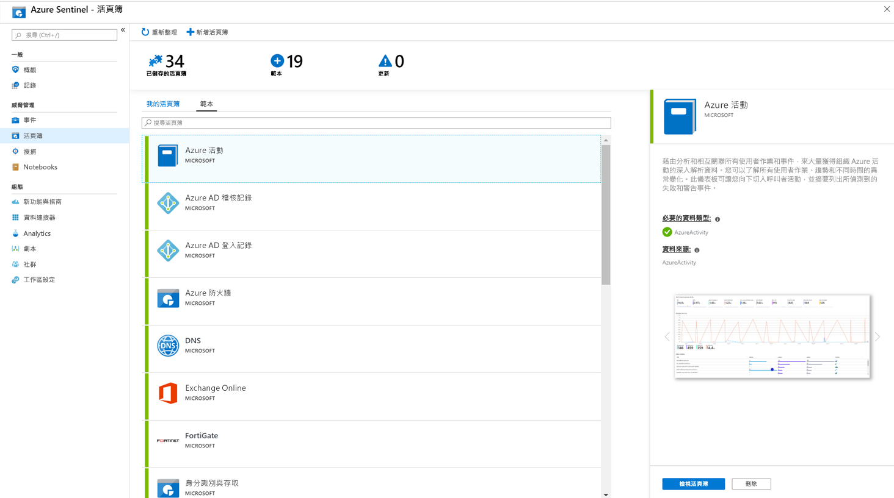

# 教學課程：將您的資料視覺化並加以監視

在您 連接資料來源 Azure Sentinel 之後，您可以使用 Azure 監視器活頁簿的 Azure Sentinel 採用來視覺化和監視資料，這可提供建立自訂儀表板的豐富功能。Azure Sentinel 可讓您建立資料的自訂活頁簿，同時還隨附內建活頁簿範本，可讓您在連線資料來源後快速取得資料的見解。

本教學課程可協助您在 Azure Sentinel 中將資料視覺化。
> [!div class="checklist"]
> * 使用內建活頁簿
> * 建立新活頁簿

## 必要條件

- 在 Azure Sentinel 工作區的資源群組上，您至少必須擁有活頁簿讀取者或活頁簿參與者許可權。

> [!NOTE]
> 您可以在 Azure Sentinel 中看到的活頁簿會儲存在 Azure Sentinel 工作區資源群組中，並由其建立所在的工作區加以標記。

## 使用內建活頁簿

1. 移至 [活頁**簿**]，然後選取 [**範本**]，以查看 Azure Sentinel 內建活頁簿的完整清單。 若要查看哪些與您已連接的資料類型有關，每個活頁簿中的 [**必要資料類型**] 欄位將會列出綠色核取記號旁的資料類型（如果您已經將相關資料串流至 Azure Sentinel。
  
1. 按一下 [ **View 活頁簿**] 以查看填入資料的範本。
  
1. 若要編輯活頁簿，請選取 [**儲存**]，然後選取您要為範本儲存 json 檔案的位置。 

   > [!NOTE]
   > 這會根據相關範本建立 Azure 資源，並儲存範本 Json 檔案本身，而不是資料。

1. 選取 [ **View 活頁簿**]。 然後，按一下頂端的 [**編輯**] 按鈕。 您現在可以編輯活頁簿，並根據您的需求進行自訂。 如需如何自訂活頁簿的詳細資訊，請參閱如何[使用 Azure 監視器活頁簿建立互動式報表](../azure-monitor/app/usage-workbooks.md)。

1. 進行變更之後，您就可以儲存活頁簿。 

1. 您也可以複製活頁簿：選取 [**編輯**]，然後按一下 [**另存**新檔]，並確定在相同的訂用帳戶和資源群組下，以另一個名稱儲存。 這些活頁簿會顯示在 [我的活頁**簿**] 索引標籤底下。

## 建立新的活頁簿

1. 移至 [活頁**簿**]，然後選取 [**加入活頁簿**]，從頭開始建立新的活頁簿。
  

1. 若要編輯活頁簿，請選取 [**編輯**]，然後視需要加入文字、查詢和參數。 如需如何自訂活頁簿的詳細資訊，請參閱如何[使用 Azure 監視器活頁簿建立互動式報表](../azure-monitor/app/usage-workbooks.md)。 

1. 建立查詢時，請將 [**資料來源**] 設定為 [**記錄**]，將 [**資源類型**] 設定為 [ **Log Analytics** ]，然後選擇相關的工作區。 

1. 建立活頁簿之後，請儲存活頁簿，並確定您將它儲存在 Azure Sentinel 工作區的訂用帳戶和資源群組底下。

1. 如果您想要讓組織中的其他人使用活頁簿，請在 [**儲存**] 底下選取 [**共用報表**]。 如果您想要讓此活頁簿僅供您使用，請選取 [**我的報表**]。

1. 若要在工作區中的活頁簿之間切換，您可以在任何活頁簿的上方窗格中，選取 [**開啟**![切換活頁簿]](./media/tutorial-monitor-data/switch.png)。 在開啟右側的視窗中，于活頁簿之間切換。

   

## 如何刪除活頁簿

您可以刪除從 Azure Sentinel 範本建立的活頁簿。 

若要刪除自訂的活頁簿，請在 [活頁簿] 頁面中，選取您想要刪除的已儲存活頁簿，然後選取 [**刪除**]。 這會移除已儲存的活頁簿。

> [!NOTE]
> 這會移除資源，以及您對範本所做的任何變更。 原始範本仍可供使用。

## 後續步驟

在本教學課程中，您已瞭解如何在 Azure Sentinel 中查看您的資料。

若要瞭解如何將威脅的回應自動化，請參閱[在 Azure Sentinel 中設定自動威脅回應](tutorial-respond-threats-playbook.md)。
