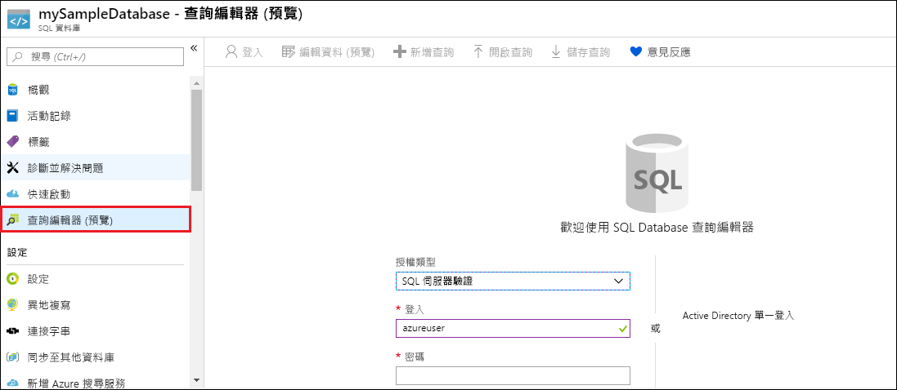
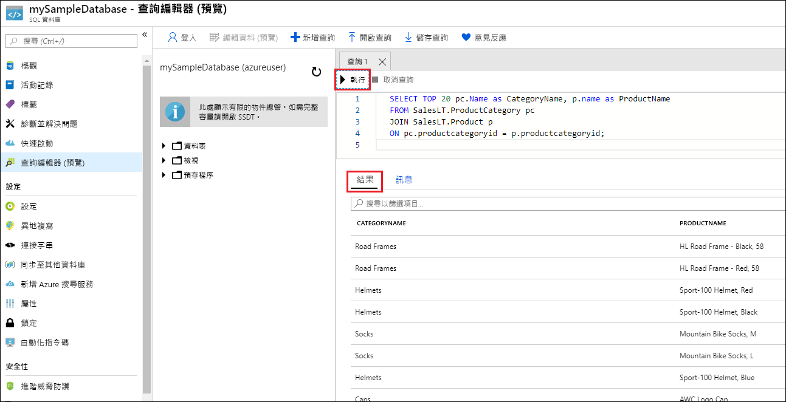

# <a name="quickstart-create-a-single-database-in-azure-sql-database-using-the-azure-resource-manager-template"></a>快速入門：使用 Azure Resource Manager 範本在 Azure SQL Database 中建立單一資料庫

要在 Azure SQL Database 中建立資料庫，建立[單一資料庫](sql-database-single-database.md)是最快速且最簡單的部署選項。 本快速入門說明如何使用 Azure Resource Manager 範本建立單一資料庫。 如需詳細資訊，請參閱 [Azure Resource Manager 文件](/azure/azure-resource-manager/)。

如果您沒有 Azure 訂用帳戶，請[建立免費帳戶](https://azure.microsoft.com/free/)。

## <a name="create-a-single-database"></a>建立單一資料庫

單一資料庫具有一組使用兩個[購買模型](sql-database-purchase-models.md)之一定義的計算、記憶體、IO 和儲存體資源。 當您建立單一資料庫時，您也會定義 [SQL Database 伺服器](sql-database-servers.md)加以管理，並將其放入指定區域中的 [Azure 資源群組](../azure-resource-manager/management/overview.md)內。


# <a name="azure-clitabazure-cli"></a>[Azure CLI](#tab/azure-cli)

```
# Set variables
resourceGroupName=myResourceGroup
location="eastus"
adminLogin=azureuser
password="w6YuxrWYTdUqJQqq"
serverName=mysqlserver-$RANDOM
databaseName=mySampleDatabase

# Configure a firewall rule for the server
echo "Configuring firewall..."
az sql server firewall-rule create \
   --resource-group $resourceGroupName \
   --server $serverName \
   -n AllowYourIp \
   --start-ip-address $startip \
   --end-ip-address $endip

# Create a gen5 1vCore database in the server 
echo "Creating a gen5 2 vCore database..."
az sql db create \
   --resource-group $resourceGroupName \
   --server $serverName \
   --name $databaseName \
   --sample-name AdventureWorksLT
```

* * *

## <a name="query-the-database"></a>查詢資料庫

若要查詢資料庫，請參閱[查詢資料庫](./sql-database-single-database-get-started.md#query-the-database)。


您現在已建立資料庫，接著請使用 Azure 入口網站內建的查詢工具連線到資料庫，並查詢資料。

1. 在資料庫的 [SQL Database]  頁面上，選取左側功能表中的 [查詢編輯器 (預覽)]  。

   

2. 輸入您的登入資訊，並選取 [確定]  。

針對登入過程可能會發生的問題，進行防火牆設定
```
startip=1.0.0.0
endip=255.255.255.255

# Create a logical server in the resource group
echo "Creating primary logical server..."
az sql server create \
   --name $serverName \
   --resource-group $resourceGroupName \
   --location $location  \
   --admin-user $adminLogin \
   --admin-password $password
```

3. 在 [查詢編輯器]  窗格中輸入下列查詢。

   ```sql
   SELECT TOP 20 pc.Name as CategoryName, p.name as ProductName
   FROM SalesLT.ProductCategory pc
   JOIN SalesLT.Product p
   ON pc.productcategoryid = p.productcategoryid;
   ```

4. 選取 [執行]  ，然後在 [結果]  窗格中檢閱查詢結果。

   

5. 關閉 [查詢編輯器]  頁面，並在系統提示是否要捨