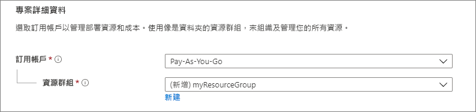
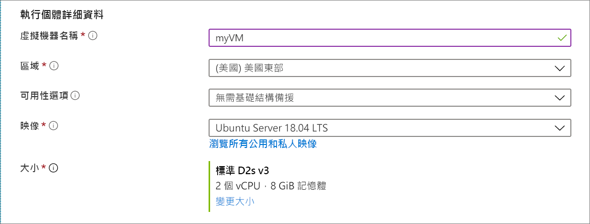
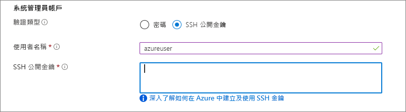
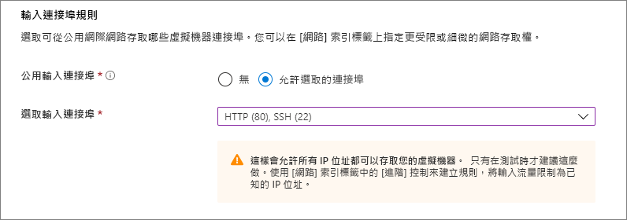
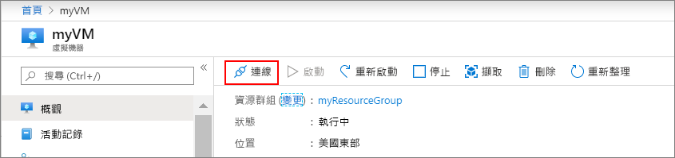

# <a name="quickstart-create-a-linux-virtual-machine-in-the-azure-portal"></a>快速入門：在 Azure 入口網站中建立 Linux 虛擬機器

您可以透過 Azure 入口網站建立 Azure 虛擬機器 (VM)。 Azure 入口網站是以瀏覽器為基礎的使用者介面，可用來建立 Azure 資源。 本快速入門說明如何使用 Azure 入口網站，來部署執行 Ubuntu 18.04 LTS 的 Linux 虛擬機器 (VM)。 為了查看作用中的 VM，您還會以 SSH 連線至 VM，並安裝 NGINX 網頁伺服器。

如果您沒有 Azure 訂用帳戶，請在開始前建立[免費帳戶](https://azure.microsoft.com/free/?WT.mc_id=A261C142F)。

## <a name="create-ssh-key-pair"></a>建立 SSH 金鑰組

您必須要有 SSH 金鑰組，才能完成本快速入門的操作。 如果您已經擁有 SSH 金鑰組，則可略過此步驟。

開啟 Bash 殼層，然後使用 [ssh-keygen](https://www.ssh.com/ssh/keygen/) 來建立 SSH 金鑰組。 如果本機電腦上沒有 Bash 殼層，則可以使用 [Azure Cloud Shell](https://shell.azure.com/bash)。


1. 登入 [Azure 入口網站](https://portal.azure.com)。
1. 在頁面頂端的功能表中，選取 `>_` 圖示以開啟 Cloud Shell。
1. 請確定 CloudShell 在左上方顯示 **Bash**。 如果其顯示 PowerShell，請使用下拉式清單來選取 [Bash]  ，然後選取 [確認]  以變更為 Bash 殼層。
1. 輸入 `ssh-keygen -t rsa -b 2048` 以建立 ssh 金鑰。 
1. 系統會提示您輸入用來儲存金鑰組的檔案。 只要按 **Enter** 鍵即可儲存在預設位置 (以括弧列出)。 
1. 系統會要求您輸入複雜密碼。 您可以輸入 SSH 金鑰的複雜密碼，或按 **Enter** 鍵以無複雜密碼的狀態繼續進行。
1. `ssh-keygen` 命令會在 `~/.ssh directory` 中產生具有預設名稱 `id_rsa` 的公開和私密金鑰。 此命令會傳回公開金鑰的完整路徑。 請使用公開金鑰的路徑，透過輸入 `cat ~/.ssh/id_rsa.pub` 來以 `cat` 顯示其內容。
1. 複製此命令的輸出，並將其儲存在某處以供本文稍後使用。 這是您的公開金鑰，您會在設定用來登入 VM 的系統管理員帳戶時用到它。

## <a name="sign-in-to-azure"></a>登入 Azure

請先登入 [Azure 入口網站](https://portal.azure.com) (如果您尚未登入)。

## <a name="create-virtual-machine"></a>建立虛擬機器

1. 在搜尋中輸入**虛擬機器**。
1. 在 [服務]  底下，選取 [虛擬機器]  。
1. 在 [虛擬機器]  頁面中，選取 [新增]  。 [建立虛擬機器]  頁面隨即開啟。
1. 在 [基本資料]  索引標籤中的 [專案詳細資料]  底下，確認已選取正確的訂用帳戶，然後選擇 [新建]  資源群組。 輸入 *myResourceGroup* 作為名稱*。 

    

1. 在 [執行個體詳細資料]  底下，輸入 *myAagentVM* 作為 [虛擬機器名稱]  、然後選擇 [美國東部]  作為您的 [區域]  ，然後選擇 [Ubuntu 18.04 LTS]  作為您的 [映像]   、[大小] 選擇為 [標準 DS1 v2] 。 其他部分保留預設值。

(There is problem on pic)
    

1. 在 [系統管理員帳戶]  下方選取 [SSH 公開金鑰]  ，輸入您的使用者名稱，然後貼上您的公開金鑰。 請移除公開金鑰中的任何前置或尾端的空白字元。

    

1. 在 [輸入連接埠規則]   > [公用輸入連接埠]  下方，選擇 [允許選取的連接埠]  ，然後從下拉式清單中選取 [SSH (22)]  和 [HTTP (80)]  。 

    

1. 保留其餘預設值，然後在頁面底部選取 [檢閱 + 建立]  按鈕。

8. 在 [建立虛擬機器 - 管理]  中，針對 [診斷儲存體帳戶]  ，選取 [新建]  。

9. 在 [建立儲存體帳戶]  中，輸入或選取這項資訊：
   新建如果碰到需要建立儲存體帳戶的狀況，可以在 Cloud Shell 輸入指令產生
   
    ```bash
    storageaccount="mysa"$(openssl rand -hex 10)
    echo $storageaccount
    ``` 
    | 設定 | 值 |
    | ------- | ----- |
    | 名稱 | 輸入 ($storageaccount 的值)。 如果此名稱已被使用，請建立唯一名稱。|
    | 帳戶類型 | 保留預設值 [儲存體 (一般用途 v1)]  。 |
    | 效能 | 保留預設值 [標準]  。 |
    | 複寫 | 保留預設值 [本地備援儲存體 (LRS)]  。 |
 
1. 在 [建立虛擬機器]  頁面上，您可以看到即將建立的 VM 詳細資料。 準備完成後，請選取 [建立]  。

可能需要幾分鐘的時間才能部署好 VM。 部署完成時，請前往下一節。

    
## <a name="connect-to-virtual-machine"></a>連線至虛擬機器

建立與 VM 的 SSH 連線。

1. 在 VM 的 [概觀] 頁面上選取 [連線]  按鈕。 

    

2. 在 [連線至虛擬機器]  頁面中，維持預設選項，以便使用 IP 位址透過連接埠 22 進行連線。 在**使用 VM 本機帳戶登入**中，會顯示連線命令。 選取按鈕以複製該命令。 下列範例說明 SSH 連線命令的內容：

    ```bash
    ssh azureuser@10.111.12.123
    ```

3. 使用和您建立 SSH 金鑰組時所用的同一個 Bash 殼層 (您可以重新開啟 Cloud Shell，方法是再次選取 `>_` 或移至 https://shell.azure.com/bash) ，將 SSH 連線命令貼到殼層中，以建立 SSH 工作階段。


## <a name="view-the-web-server-in-action"></a>檢視作用中的網頁伺服器

使用所選的網頁瀏覽器來查看預設 NGINX 歡迎使用頁面。 輸入 VM 的公用 IP 位址作為網址。 您可以在 VM 的 [概觀] 頁面找到公用 IP 位址，也可以在您稍早使用的 SSH 連接字串中找到。


## <a name="clean-up-resources"></a>清除資源

若不再需要，您可以刪除資源群組、虛擬機器和所有相關資源。 若要這樣做，請選取虛擬機器的資源群組，選取 [刪除]  ，然後確認要刪除的資源群組名稱。

